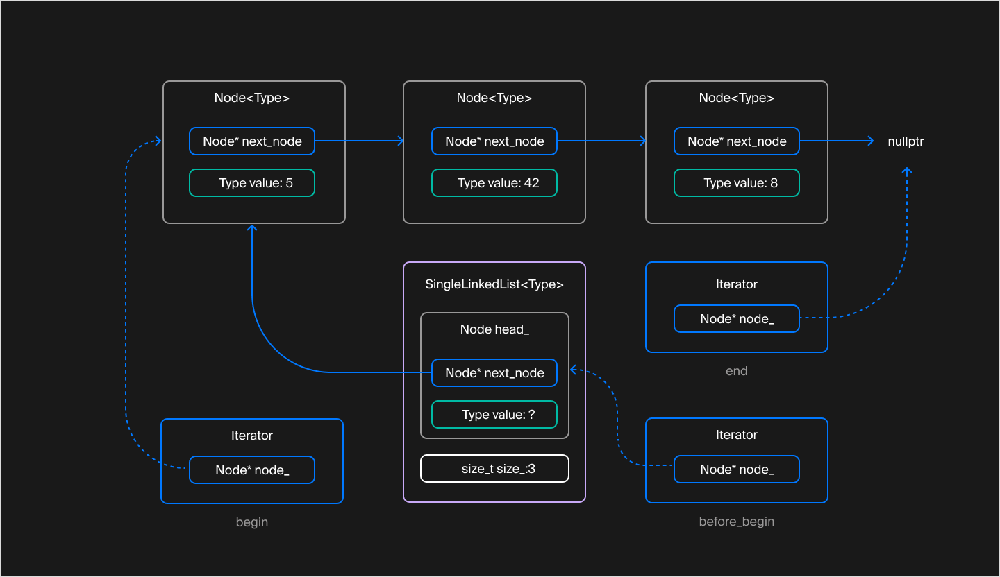

## Итераторы

Стандартные контейнеры вводят концепцию итератора — специального объекта, который играет роль указателя на элемент контейнера. Используем пару итераторов, чтобы задать подлежащий обходу диапазон [начало, конец) элементов контейнера.



Итераторы и полуинтервалы — абстракции, которые прячут особенности внутреннего устройства конкретного контейнера за унифицированным интерфейсом. Итераторы разных контейнеров похожи: они предоставляют операции * и -> для доступа к элементам, операции ++ и -- для обхода элементов в прямом и обратном направлении. Благодаря этой унификации и шаблонам один алгоритм способен обрабатывать содержимое различных контейнеров. Создавать под каждый отдельную версию алгоритма не нужно.

Чтобы класс или структура с точки зрения стандартных алгоритмов считались итератором, внутри неё должны быть объявлены следующие вложенные типы:

- iterator_category. Задаёт категорию итератора. Категория итератора сообщает стандартной библиотеке о наборе операций, поддерживаемых итератором. Например для односвязного списка будет равно std::forward_iterator_tag, так как перебор возможен только в прямом направлении.

- value_type. Задаёт тип элементов, доступ к которым предоставляет итератор. (совпадает с параметром Type шаблона)

- difference_type. Задаёт тип для хранения смещения между двумя итераторами. Используется в таких функциях как std::advance и std::distance. Опять же, для односвязного списка можно использовать std::ptrdiff_t - это целое число, разрядность которого совпадает с разрядностью указателя целевой платформы.

- pointer. Задаёт тип указателя, возвращаемого оператором ->. Для неконстантного итератора это Type*, а для константного — const Type*;

- reference. Задаёт тип ссылки, возвращаемой оператором разыменования *. В зависимости от константности итератора это либо Type&, либо const Type&.


```c++

#include <cstddef>
#include <iterator> // Содержит объявления категории итераторов 

template <typename Type>
class SingleLinkedList {
    // Шаблон класса «Базовый Итератор»
    // Определяет поведение итератора на элементы односвязного списка
    // ValueType - совпадает с Type (для Iterator) либо с const Type (для ConstIterator)
    template <typename ValueType>
    class BasicIterator {
    public:
        using iterator_category = std::forward_iterator_tag;
        using value_type = Type;
        using difference_type = std::ptrdiff_t;
        using pointer = ValueType*;
        using reference = ValueType&;
        ...
    };
    ...
};
```

Константный итератор подобен указателю на константу. Он предоставляет доступ к элементам контейнера только для чтения, при этом значение самого итератора можно менять. Стандартные контейнеры имеют константную и неконстантную версии методов begin и end, которые возвращают константный и неконстантный итераторы соответственно.

Итератор категории **std::forward_iterator_tag** соответствует категории однонаправленного итератора. 

*В нём должны быть объявлены следующие операции:*

* Операции == и !=. Итераторы одного и того же списка равны, если указывают на одну и ту же позицию. Константные и неконстантные итераторы одного и того же списка можно сравнивать друг с другом;

* Операция инкремента ++. Перемещает итератор на следующую позицию в списке;

* Операции * и -> для доступа к элементу списка. Возвращают ссылку и указатель на значение, хранящееся в списке, а не на весь узел списка, задаваемый вложенной структурой Node. Помните, итераторы должны скрывать внутреннее устройство контейнера от внешнего мира.

```c++
template <typename Type>
class SingleLinkedList {
    template <typename ValueType>
    class BasicIterator {
    public:
        ...
        [[nodiscard]] bool operator==(const BasicIterator<const Type>& rhs) const noexcept {...}
        [[nodiscard]] bool operator!=(const BasicIterator<const Type>& rhs) const noexcept {...}
        [[nodiscard]] bool operator==(const BasicIterator<Type>& rhs) const noexcept {...}
        [[nodiscard]] bool operator!=(const BasicIterator<Type>& rhs) const noexcept {...}

        BasicIterator& operator++() noexcept {...}
        BasicIterator operator++(int) noexcept {...}

        [[nodiscard]] reference operator*() const noexcept {...}
        [[nodiscard]] pointer operator->() const noexcept {...}
    ...
    };
    ...
};
```

Чтобы использовать == и != для сравнения константных и неконстантных итераторов, нужно объявить две версии этих операций.

Обратите внимание на перегрузку операции инкремента. Вспомним, что в C++ есть префиксная и постфиксная формы операции инкремента и декремента.

- Префиксная версия модифицирует объект и возвращает ссылку на текущий экземпляр класса.
- Постфиксная версия модифицирует объект и возвращает копию прежнего значения объекта.

Постфиксная форма операций инкремента и декремента принимает фиктивный параметр типа int, который не используется и только подсказывает компилятору, какая версия переопределена. Как правило, постфиксная форма основывается на функционале префиксной:

```c++
class MyType {
public:
    // Перегрузка префиксной формы
    MyType& operator++() {
        /* изменяем текущий объект */
        return *this;
    }
    // Перегрузка постфиксной формы
    MyType operator++(int) {
        auto old_value(*this); // Сохраняем прежнее значение объекта для последующего возврата
        ++(*this); // используем логику префиксной формы инкремента
        return old_value;
    }
    ...
};
```

Во внутреннем представлении итератор односвязного списка хранит указатель на узел списка. В операциях * и -> этот указатель разыменовывается, а после инкремента итератора ссылается на следующий узел списка.

Чтобы защитить внутреннюю структуру списка от доступа извне, создавать итератор, ссылающийся на позицию внутри списка, можно только внутри SingleLinkedList. Для этого в конструктор итератора передаётся указатель на приватную структуру Node, доступную методам класса SingleLinkedList и его внутренним классам и структурам. Поэтому шаблон BasicIterator объявлен внутри класса списка — так ему доступен приватный тип Node внешнего класса.

С другой стороны, некоторым операциям списка может понадобиться доступ к указателю на узел внутри итератора. Классы списка и его итератора оказываются так тесно связаны друг с другом, что им требуется доступ к деталям реализации друг друга!

В C++ класс или структура могут объявить о своём безграничном доверии другому классу/структуре или функции, назвав их дружественными. Для этого применяют ключевое слово friend. Класс разрешает дружественным классам, структурам и функциям доступ к своей приватной области. Пользоваться этой возможностью стоит очень осторожно, так как изменения в приватной части класса могут повлиять на работу его друзей.

```c++
template <typename Type>
class SingleLinkedList {
    template <typename ValueType>
    class BasicIterator {
       ...
    private:
        // Разрешаем SingleLinkedList обращаться к приватной области
        friend class SingleLinkedList;
        explicit BasicIterator(Node* node) {...}
        Node* node_ = nullptr;
    };

public:
    using Iterator = BasicIterator<Type>;
    using ConstIterator = BasicIterator<const Type>;

    [[nodiscard]] Iterator begin() noexcept {
        // Благодаря дружбе SingleLinkedList имеет доступ к приватному конструктору своего итератора
        return Iterator{head_.next_node};
    }
    ...
};
```

### Поддержка обхода элементов

Как и многое в C++, проход по элементам циклом range-based for — не привилегия, доступная лишь стандартным контейнерам. Поддержку этого цикла можно добавить любому классу, включив в него публичные методы begin и end. Они возвращают STL-совместимые итераторы, задающие диапазон элементов контейнера:

```c++
template <typename Type>
class SingleLinkedList {
public:
    [[nodiscard]] Iterator begin() noexcept {...}
    [[nodiscard]] Iterator end() noexcept {...}
    // Константные версии begin/end для обхода списка без возможности модификации его элементов
    [[nodiscard]] ConstIterator begin() const noexcept {...}
    [[nodiscard]] ConstIterator end() const noexcept {...}
    // Методы для удобного получения константных итераторов у неконстантного контейнера
    [[nodiscard]] ConstIterator cbegin() const noexcept {...}
    [[nodiscard]] ConstIterator cend() const noexcept {...}
    ...
};

int main() {
    SingleLinkedList<int> list;
    ...
    // Благодаря методам begin и end SingleLinkedList поддерживает range-based for
    for (int& item : list) {
        *item *= 2;
    }
}
```

