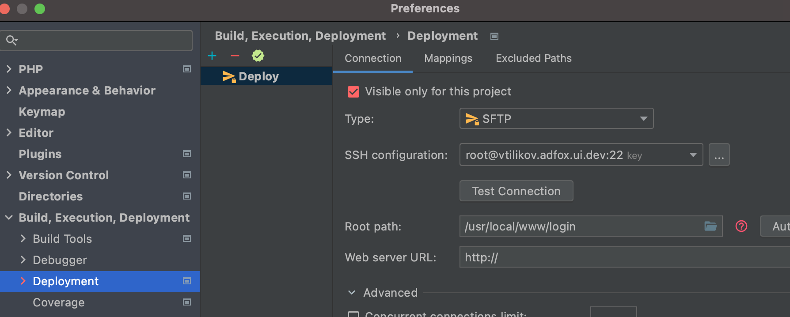

## ASAN ( Address sanitizer )

Не все ошибки сводятся к неправильному использованию стандартной библиотеки. И следовательно, не все из них можно обнаружить проверками, которые включаются отладочными макроопределениями.

Современные компиляторы имеют дополнительные инструменты, выполняющие проверки, не предусмотренные в коде программы. Они называются санитайзерами. Санитайзеры позволяют собрать программу в режиме усиленного поиска ошибок.

Создаем отдельный профиль ASAN в CLion

со следующиющими настройками



В CMakeList.txt тоже надо включить конфиг

```bash
...

set (ASAN_SYMBOLIZER_PATH /usr/local/opt/llvm/bin)
set (CMAKE_CXX_FLAGS ${CompilerFlags} -fsanitize=address)

...

if (MSVC)
    # warning level 4 and all warnings as errors
    add_compile_options(/W4 /WX)
else()
    # lots of warnings and all warnings as errors
    add_compile_options(-Wall -Wextra -pedantic -Werror -save-temps)
    add_compile_options(-g -O1 -fno-omit-frame-pointer -fno-optimize-sibling-calls)
endif()

...

```

Может быть потребуется установить llvm-symbolizer. Делается это просто: 

```bash
brew install llvm
```

По-умолчанию он будет установлен в /usr/local/opt/llvm/bin . Глобальной видимости не будет, поэтому нужно будет прописать в окружении: 

```bash
set (ASAN_SYMBOLIZER_PATH /usr/local/opt/llvm/bin)
```

Для определения утечек памяти можно (и нужно) использовать:

```bash
set (CMAKE_CXX_FLAGS ${CompilerFlags} -fsanitize=leak)
```

### А лучше определять это через переменные окружение и немного универсализировать

```bash
if ($ENV{ASAN_ON})
    set (ASAN_SYMBOLIZER_PATH /usr/local/opt/llvm/bin)
    set (CMAKE_CXX_FLAGS ${CompilerFlags} -fsanitize=address)
elseif ($ENV{LSAN_ON})
    set (LSAN_SYMBOLIZER_PATH /usr/local/opt/llvm/bin)
    set (CMAKE_CXX_FLAGS ${CompilerFlags} -fsanitize=leak)
endif()

if (MSVC)
    # warning level 4 and all warnings as errors
    add_compile_options(/W4 /WX)
else()
    # lots of warnings and all warnings as errors
    add_compile_options(-Wall -Wextra -pedantic -Werror -save-temps)

    if ($ENV{ASAN_ON})
        add_compile_options(-g -O1 -fno-omit-frame-pointer -fno-optimize-sibling-calls)
    endif()

    if ($ENV{LSAN_ON})
        add_compile_options(-g -O1 -fno-omit-frame-pointer -fno-optimize-sibling-calls)
    endif()
endif()
```

А в настройках нужного профайла в ИДЕ указать переменную окружения: 

```bash
ASAN_ON=1
или
LSAN_ON=1
```


### Другие санитайзеры

-fsanitize=memory - только Linux 
